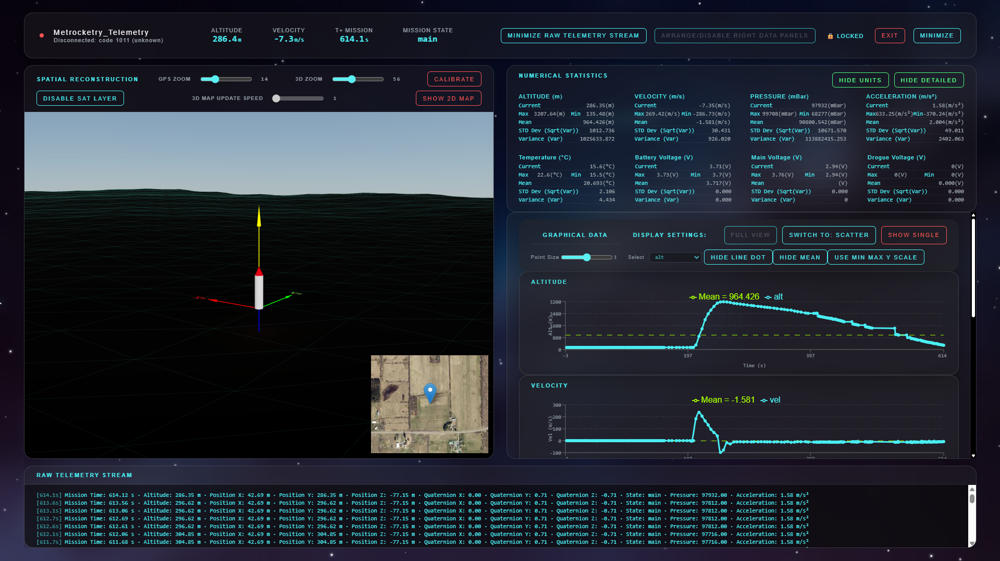

  

  <h1 align="center">Avionics SRAD Ground Station</h3>
   <h3 align="center">Version: V0.1</h3>

  

     Custom SRAD GUI for 2025-2026, Successor GUI to <a href="https://github.com/Ryerson-Rocketry/Groundstation-GUI-Electron">Avionics GUI Used 2024-2025</a>.
     
    <a href="https://github.com/TBA/TBA/tree/main/_Documentation"><strong>See Main Documentation »</strong></a>
    <a href="https://github.com/TBA/TBA/tree/main/_Documentation"><strong>See User Manual »</strong></a>
     
  

  
Table of Contents

  <ol>
    <li><a href="#overview">Overview</a> </li>
    <li><a href="#telemetry">Telemetry</a> </li>
	<li><a href="#built-with">Built With</a></li>
    <li><a href="#getting-started-development">Getting Started (Development)</a></li>
    <li><a href="#documentation">Documentation</a></li>
    <li><a href="#license">License</a></li>
    <li><a href="#attributions-and-acknowledgements">Attributions and Acknowledgments</a></li>
  </ol>

# Overview

Preview - Version V0.1 - 2026-05-08

<video src="_Documentation/Videos/long_demo_v_0_1_0.webm" controls></video> 
Long Demo (Using Test Launch Data) - Version V0.1 - 2026-05-08 (See other demos in _Documentation/Videos)

### Purpose
Desktop application specifically for displaying both raw and parsed telemetry data transmitted from Avionics' specific onboard firmware. Overall application comprises the Tauri built application as well as a Python webserver for receiving data from a connected radio.

(<a href="#readme-top">back to top</a>)

# Telemetry 

To provide data to the GUI, a Python Webserver with serial port access is used (a connected radio receiver should be used in conjunction with this). At this time only hardcoded data that is required is supported
- Note: Will include custom data mapping (via a specified schema) later

General Flow is from CSV string received from the Webserver which is then parsed into a JSON object for use in the GUI itself. The CSV string can be parsed either using headers received from radio or on a positional basis (via. position of element in csv string)

## Supported Telemetry Data
### Hardcoded Data

| Data            | Radio (Header/Position) -> Webserver JSON Mapping | Webserver -> Tauri JSON Mapping | Data Type | Data Vis                      |
| --------------- | ------------------------------------------------- | ------------------------------- | --------- | ----------------------------- |
| Latitude        | latitude -> x                                     |                                 | Number    | 2D Map                        |
| Longitude       | longitude -> z                                    |                                 | Number    | 2D Map                        |
| Altitude        | altitude -> y                                     |                                 | Number    | 2D Map 3D Map Graph     |
| Pressure        | pressure ->                                       |                                 | Number    | Numerical Statistics Graph |
| Temperature     | temperature -> temp                               |                                 | Number    | Numerical Statistics Graph |
| Battery Voltage | battery_voltage -> battVolt                       |                                 | Number    | Numerical Statistics          |
| Main Voltage    | main_voltage -> mainVolt                          |                                 | Number    | Numerical Statistics          |
| Drogue Voltage  | drogue_voltage -> drogVolt                        |                                 | Number    | Numerical Statistics          |
| Velocity        | speed -> vel                                      |                                 | Number    | Numerical Statistics Graph |
| Acceleration    | acceleration -> acceleration                      |                                 | Number    | Numerical Statistics Graph |
| State           | state_name -> state                               |                                 | String    | Top Mission Display           |
| Time            | time -> timestamp                                 |                                 | Number    | Graph                         |

## Telemetry View Modules

| Module               | Position                                                        | Description                                                                                                                                                                                                                   | Data Supported                                                                                                 |
| -------------------- | --------------------------------------------------------------- | ----------------------------------------------------------------------------------------------------------------------------------------------------------------------------------------------------------------------------- | -------------------------------------------------------------------------------------------------------------- |
| Graph                | Altitude Velocity Acceleration Pressure Temperature | Shows all data points recorded on graphs. Has option for single graph view, all graph view, or full screen graph views.  Note: For scaling, custom y axis domain may be switched on (datamin, datamax) or to auto scale | Altitude Velocity Acceleration Pressure Temperature                                                |
| Numerical Statistics | Right                                                           | By default, shows current value, max, min, and mean. If expanded, will show Standard Deviation and Variance. May also show uni                                                                                                | Altitude Velocity Acceleration Pressure Temperature Voltage (Battery, Main, Drogue)    |
| 2D Map               | Left                                                            | Shows current rocket position on a 2D map using Leaflet. May switch between satellite view and normal view                                                                                                                    | Latitude Longitude                                                                                          |
| 3D Map               | Left                                                            | (EXPERIMENTAL) Shows current rocket position, may be performance heavy                                                                                                                                                        | Latitude Longitude Altitude                                                                              |

(<a href="#readme-top">back to top</a>)

# Built With

### Main Desktop Tech Stack
*  - Application/Backend Framework
	*  - Frontend Library/Framework
		*  - 3D Library
		*  - Graph Library
		*   - Mapping Library

### Python Webserver Sub Process Tech Stack
*  - Python Standalone Binary Builder
	*  - Serial Communication Library
	*  - Web Server Library

### Languages
*  
* ) 
* ) 

(<a href="#readme-top">back to top</a>)

# Getting Started (Development)

TBD
### Requirements  
- Cargo (Rust package manager)
- Python
- Git

### Installation (Windows 10/11)

TBD 

For more detailed instructions, see [Documentation (Link to Markdown README in Documentation Folder)](_Documentation/README.md)

(<a href="#readme-top">back to top</a>)

# Documentation

(TBD)

This project uses [Obsidian](https://obsidian.md) for Markdown file editing. Most documentation for this project is included with the "\_Documentation" folder. Documentation is either in Markdown for text or Draw.io files for diagrams (can be downloaded and imported into Draw.io to read or directly opened in VSCode using extensions). Note that documentation may not always be up to date. All documentation can be found in the \_Documentation folder in this repo.

(<a href="#readme-top">back to top</a>)

# License

N/A

(<a href="#readme-top">back to top</a>)

# Attributions And Acknowledgements
### Acknowledgements
- [Michael Czomko](https://github.com/AlphaCloudX) - Did the vast majority of the GUI in March 2026. Project forked from his original repo [here](https://github.com/AlphaCloudX/Aerial-Vehicle-Telemetry-Dashboard). 

## Attributions
- ESRI - Free GIS provider (used for satellite view in this software)
- OSM - Open Source Map Provider