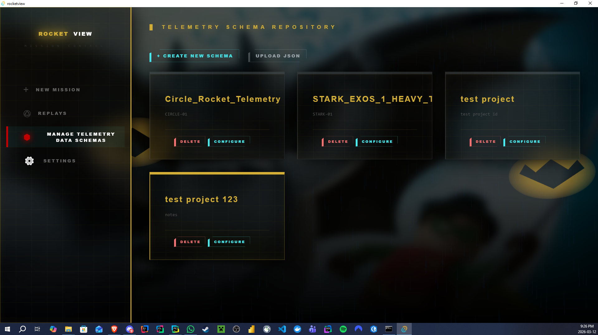
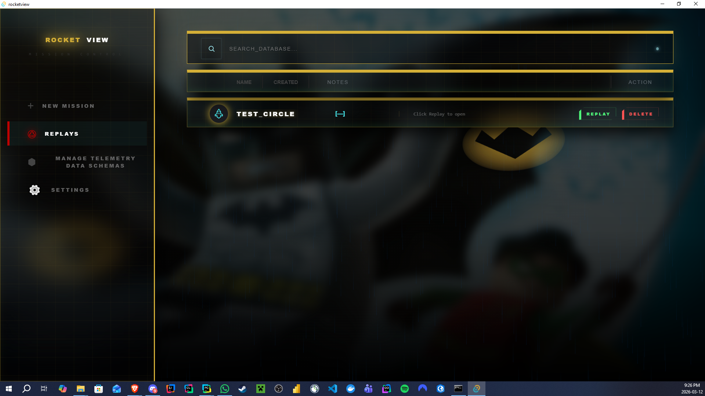
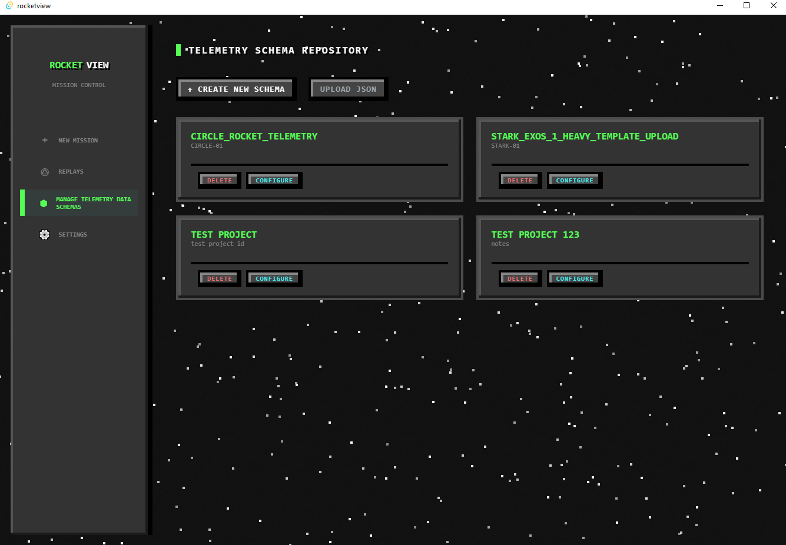
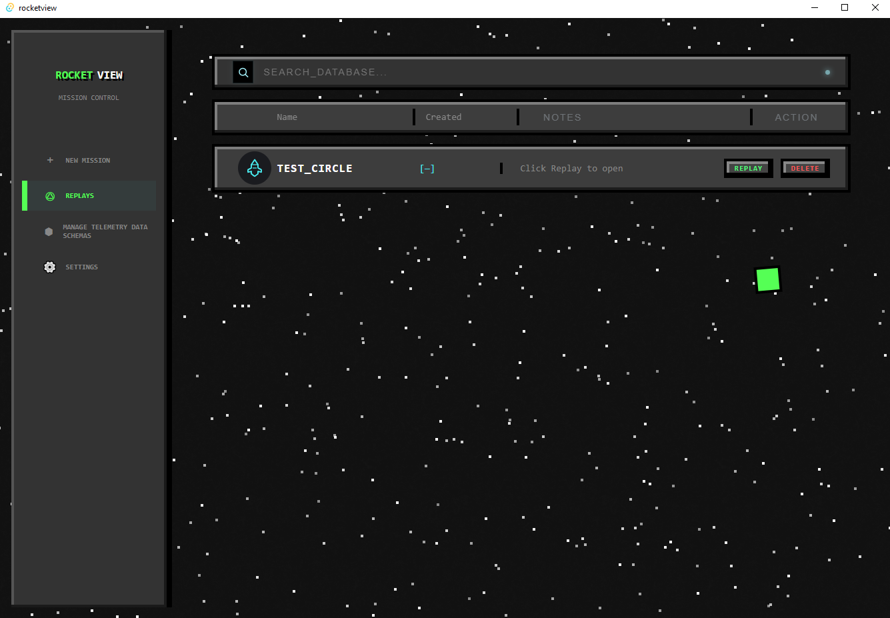

# ROCKET VIEW

A desktop mission control application for real-time rocket telemetry visualization. RocketView connects to an external WebSocket server streaming telemetry data and renders it as a live 3D scene, charts, statistics, and a raw data terminal. It also supports recording missions to disk and replaying them later.

Built with **Tauri v2** (Rust backend) + **React 19** + **Vite 7** + **Three.js**.

---

## Samples

### Batman Theme

| Manage Schemas | Replays |
|:-:|:-:|
|  |  |

### Retro Theme

| Manage Schemas | Replays |
|:-:|:-:|
|  |  |

### Demo Video

A sample video walkthrough is available at [`samples/samplevideo.mp4`](samples/samplevideo.mp4).

---

## Features

### New Mission
- Enter a mission name and launch notes (weather, crew, conditions, etc.)
- Select a telemetry schema from previously saved schemas
- Toggle saving mission data to disk for later replay
- Configure the WebSocket server IP and port (default `127.0.0.1:8765`)
- Connect with an 8-second timeout and launch directly into the live dashboard
- Inline schema preview to verify field mappings before launch

### Live Telemetry Dashboard
- **3D Visualization** -- Real-time rocket model with quaternion-based orientation, labeled local axes (X/Y/Z), and a flame effect rendered with React Three Fiber
- **Launch Platform** -- Procedurally generated terrain with wireframe overlay and N/S/E/W compass labels
- **Height Landmarks** -- Animated scale reference objects (car at 1.5 m, house at 10 m, airplane at 100 m, CN Tower at 553 m)
- **Trajectory Line** -- Color-coded by speed (HSL gradient from blue to red) with a dashed white prediction line based on current velocity and gravity
- **Camera Controls** -- Smooth lock-on tracking mode or free orbit / keyboard controls (WASD + QE) with a zoom slider
- **Altitude Chart** -- Recharts line chart of altitude over time with configurable update intervals (0.25 s, 0.5 s, 1 s, 2 s)
- **Descriptive Statistics** -- Real-time min, max, mean, and median for altitude and velocity
- **GPS Recovery Map** -- Optional Leaflet map with auto-recentering marker (enabled per schema)
- **Terminal Panel** -- Scrolling raw telemetry log showing fields configured with `show_in_terminal` in the schema
- **Header Bar** -- Connection status indicator, mission name, live altitude/velocity/mission-time readouts, camera lock toggle, and exit button

### Mission Recording & Replay
- During a live session, incoming WebSocket packets are buffered and flushed to disk every 3 seconds as numbered CSV part files via the Rust backend
- On exit, part files are merged into a single `telemetry.csv` with updated metadata
- Replay dashboard reuses all live panels (3D, chart, stats, terminal) driven by a timeline scrubber
- Playback controls: play/pause, seek, and speed adjustment (0.25x to 4x)

### Replays Archive
- Lists all saved mission recordings as cards with mission name, date, and notes
- Search bar and sortable filter columns (Name, Created, Notes, Action)
- One-click replay or delete (with confirmation dialog)

### Manage Telemetry Data Schemas
- Full CRUD interface for telemetry schemas displayed as a card grid
- **Create new schemas** with an interactive builder:
  - Identity section: schema name and vessel ID
  - Core modules: toggle 3D Attitude Visualizer, Recovery Map, and System Terminal
  - Telemetry mapping: dynamic field list where each field defines a source key, display label, data type, unit, system mapping (axis, orientation, GPS, etc.), and per-field visualizer/statistics toggles
- **Upload JSON** to import an existing schema file
- **Raw JSON editor** as an alternative to the visual builder
- **Configure** existing schemas or **delete** them

### Settings
- Theme selector with 6 built-in themes and persistent save to disk
- Displays the current schema repository path and mission archive path (stored in OS AppData)

### Themes

RocketView ships with 6 themes, each with unique component styles:

| Theme | Description |
|-------|-------------|
| Dark | Default sci-fi dark theme |
| Light | Light variant |
| Retro | Retro-styled aesthetic |
| 8-Bit | Pixel art inspired |
| Minecraft | Minecraft-inspired |
| Batman | Dark Knight theme |

### Background Effects
- Animated starfield with 600 twinkling stars (randomized size, position, opacity, and animation timing)
- Animated ship elements that fly across the screen

---

## Telemetry Schema

Telemetry schemas define how incoming JSON packets are parsed and mapped to the dashboard's visualizers. A sample schema is available in the [`schemas/`](schemas/) folder.

The sample [`circle_rocket_telemetry.json`](schemas/circle_rocket_telemetry.json) maps 9 fields including mission time, altitude, 3D position (X/Y/Z), and quaternion orientation (X/Y/Z/W). Each field specifies:

- `source_key` -- the JSON path in incoming telemetry packets (e.g. `position.x`, `quaternion.w`)
- `label` -- human-readable display name
- `type` -- data type (`float`, `int`, `string`, `bool`, `quaternion`, `gps_coord`)
- `unit` -- measurement unit (`m`, `s`, `m/s`, `deg`, `Pa`, etc.)
- `mapping` -- system mapping (`x_axis`, `y_axis`, `z_axis`, `orientation`, `latitude`, `longitude`, or `null`)
- `visualizers` -- per-field toggles for terminal output, time-series chart, and statistics (min, max, mean, median, var, std)

The schema also defines top-level `features` (3D view, map view, terminal) and `mission_metadata` (name, vessel ID). Use the built-in schema manager to create, edit, upload, and delete schemas from within the app.

---

## Tech Stack

| Layer | Technology |
|-------|------------|
| Desktop framework | Tauri v2 |
| Backend | Rust (serde, chrono, local-ip-address) |
| Frontend | React 19 |
| Build tool | Vite 7 |
| 3D rendering | Three.js + React Three Fiber + Drei |
| Charts | Recharts |
| Maps | Leaflet + react-leaflet |
| Fonts | Orbitron (headings), Google Sans (body) |

---

## Getting Started

### Prerequisites

- [Node.js](https://nodejs.org/)
- [Rust](https://www.rust-lang.org/tools/install)
- [Tauri v2 prerequisites](https://v2.tauri.app/start/prerequisites/)

### Installation

```bash
npm install
```

### Development

```bash
npm run tauri dev
```

Or use the included batch file:

```bash
run_tauri.bat
```

The Vite dev server starts on port 1420 and Tauri wraps it in a native window.

### Recommended IDE Setup

- [VS Code](https://code.visualstudio.com/) + [Tauri](https://marketplace.visualstudio.com/items?itemName=tauri-apps.tauri-vscode) + [rust-analyzer](https://marketplace.visualstudio.com/items?itemName=rust-lang.rust-analyzer)

---

## Data Storage

RocketView stores data in the OS AppData directory:

- **Windows**: `%APPDATA%/com.michael.rocketview/`
  - `schemas/` -- saved telemetry schema JSON files
  - `saves/` -- recorded mission folders (each containing `save.json`, `schema.json`, and `telemetry.csv`)
  - `settings.json` -- persisted app settings (theme, etc.)
