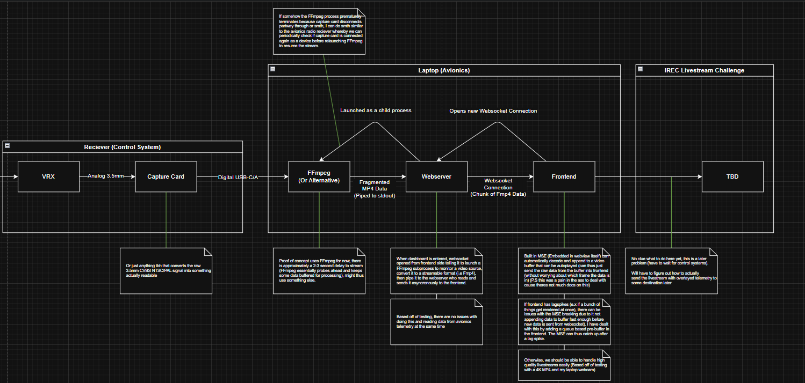

Last modified (2026-08-31)

GUI is to support a livestream from the Control Systems team. Planning to do a full rewrite of the frontend and backend. Therefore for now this is just a proof of concept to figure out how to get data from a video source, send it to the frontend, and play it (with acceptable quality).

| Demo                                                                                                                               |
| ---------------------------------------------------------------------------------------------------------------------------------- |
|  |

# Requirements
- Overlay Avionics GUI elements atop the livestream
- Capture livestream data (from video capture card)
	- No need to record raw livestream (Control System can deal with that)
	- May need to record the modified live stream (just in case)
	- No audio either?
- Transmit the livestream with modifications to IREC

# Hardware Interfaces
- Video capture card (USB A/C)
- Interface for livestream -> TBA

# Theory

### [Media Source Extension (MSE)](https://developer.mozilla.org/en-US/docs/Web/API/Media_Source_Extensions_API)
- Instead of writing our own implementation of a video player or use a third party one, we can instead use the provided MSE API for reconstructing the stream on the frontend. 
- It provides the ability to stream media natively in the WebView Process itself.
- Concepts:
	- [MediaSource](https://developer.mozilla.org/en-US/docs/Web/API/MediaSource): A "Source" of media data, we attach this to a "Object URL" that can be played from a actual video component.
	- [SourceBuffer](https://developer.mozilla.org/en-US/docs/Web/API/SourceBuffer): Interface for handling chunks of data being sent to the MediaSource object
		- [AppendBuffer() (Method)](https://developer.mozilla.org/en-US/docs/Web/API/SourceBuffer/appendBuffer): Main way of appending new stream data
		- [UpdateEnd (Event)](https://developer.mozilla.org/en-US/docs/Web/API/SourceBuffer/updateend_event): Mainly used to get rid of stream backlog data if application was under heavy load earier
- There are several things that simplify things greatly for us as well
	- It can handle arbitrary byte data being fed into it at once (i.e for a given byte array sent from the backend, it could contain data from anywhere between 0 to N frames and the MSE handler will understand that incomplete data for a frame was sent and wait for it)
- Some things to note however (limitations)
	- We have to implement a "prebuffer" (see below implementation)
		- Reason being that when the application is under heavy load (i.e many things loaded at once), its possible that the MSE is still writing to the arrayBuffer
		- If we send data from backend too fast to the frontend, the MSE handler will just break
		- Solution is simple though, if still writing or "prebuffer" is not empty, append data to the "prebuffer"
		- We can then have the MSE go through the "prebuffer" backlog when application is no longer under heavy load
	- Can only support a limited number of formats and codexes
		- Shouldn't be a problem tbh, can convert to a support format as required in FFmpeg or smth.

### [Fragmented MP4 (Fmp4)](https://wiki.svta.org/fragmented-mp4/)
when transmitting data from from capture card, we cannot simply just send raw byte data from non fragmented mp4. Fragmented should allow us to play the stream as we receive more data on the frontend.
- No need to worry about the actual fmp4 implementation, so long as byte arrays of data sent from backend to frontend are sent in correct order and without skipping data, the MSE on frontend can handle it just fine


# Implementation

### Overall implementation



- When frontend launches dashboard and switches to livestream view, we open a new websocket to python webserver
- Webserver launches a FFmpeg process that captures data from a video source, converts to fmp4, and outputs to STDOUT
- Webserver reads piped data, periodically sends Byte Arrays of data to frontend via WebSocket connection
- Frontend receives it and either appends Byte Array data to the video handler, or places it into a "prebuffer" queue, which video handler will go through when not under heavy load


### Backend

#### Tauri
Will use the existing webserver handler code for this. No need to modify the rust backend (no need to launch a separate python process for this, the singular webserver can handle both avionics telemetry receiving and livestream transmitting).

As a refresher though, this is the relevant code for dealing with using Python process a a child process in Tauri.
``` rust
fn sidecar_handle(app: tauri::AppHandle) {
    println!("Initializiting Sidecar");
    let sidecar_command = app.shell().sidecar("webserver_proc").unwrap();
    let (mut _rx, sidecar_child) = sidecar_command
        .spawn()
        .expect("Failed to spawn sidecar");

    // Wrap the child process in Arc<Mutex<>> for shared access
    let child = Arc::new(Mutex::new(Some(sidecar_child)));

    // Clone the Arc to move into the async task
    let child_clone = Arc::clone(&child);


    let window = app.get_webview_window("main").unwrap();

    window.on_window_event( move |event| {
        if let tauri::WindowEvent::CloseRequested { .. } = event {

        let mut child_lock = child_clone.lock().unwrap();
        if let Some(mut child_process) = child_lock.take() {
            if let Err(e) = child_process.write("Exit message from Rust".as_bytes())
            {
            println!("Fail to send to stdin of Python: {}", e);
            }

            if let Err(e) = child_process.kill() {
                eprintln!("Failed to kill child process: {}", e);
            }
        }
        }
    });

    tauri::async_runtime::spawn(async move {
        // read events such as stdout
        while let Some(event) = _rx.recv().await {
            if let CommandEvent::Stdout(line_bytes) = event {
            let line = String::from_utf8_lossy(&line_bytes);
            let line_type = "test";
            app
                .emit("stdout", line.to_string())
                .expect("Failed to emit sidecar stderr event");
            println!("stdOut: {}", line);
            }
        }
    });
```
the above function simply launches the webserver as a child process, then tells it to kill itself when the Tauri application closes. It also handles transmitting STDOUT from the process (mainly used for showing raw process messages in the GUI console (for debugging and what not))


``` rust 

fn main() {
    tauri::Builder::default()
        .setup(|app| {
            let app_handle = app.handle().clone();
            if cfg!(dev) {
                // `tauri dev` only code
                println!("IN DEV MODE, REMEMBER TO LAUNCH MANUALLY PYTHON WEBSERVER");
                //sidecar_handle(app_handle);

            } else {
                // `tauri build` only code
                sidecar_handle(app_handle);
            }
    
    //REST OF CODE
```
Relevant code main, auto launch the packaged python process in production build, otherwise we maunally do it (can just launch the webserver externally for easier development)

#### Webserver


Webserver Main.py (Python)
(ignore the shit code)
``` python
try:
        async for message in websocket:   
            print ("MESSAGE RECIEVED:", flush = True)
            if (running == False): #do not allow launching more handlers on same connection
                print ("(FIRST MESSAGE: \"" + message + "\") SERVER INITIALIZING TELEMETRY MODE:", flush = True)
                match message:
                    case "demo":
                        print ("TELEMETRY IN DEMO MODE ----------", flush = True)
                        running = True
                        await rocketry_data_file_test_handler(websocket)
                    case "live":
                        print ("TELEMETRY IN LIVE MODE ----------", flush = True)
                        running = True
                        await radio_handle(websocket)
                    case "livestream":
                        print ("LIVESTREAM PROCESS LAUNCHED ----------", flush = True)
                        running = True
                        await livestream_handler.livestream_process_handler(websocket)
                    case _:
                        print ("INVALID CASE", flush = True)
            else:
                print ("(SECOND+ MESSAGE: \"" + message + ") SERVER ALREADY RUNNING", flush = True)
```
Only need to add another keyword "livestream", which launches another handler for dealing with the livestream

Livestream Handler.py
``` python

async def livestream_process_handler(websocket):
    """ideally should exit if websocket is terminated frontend side, should ensure the ffmpeg proc is gone as well"""
    pipe = None
    while True:
        try: #main loop
            startTime = time.time()
            buffer = []
            sentBurst = False

            #-re: "Read input at native frame rate. Mainly used to simulate a grab device."
            #-f: stream a mpeg video to the process pipe
            """
            proc_string = f"ffmpeg.exe -y \
                -re \
                -framerate 15\
                -i test_video.mp4 \
                -c:v libvpx \
                -c:a libopus \
                -f webm pipe:stdout"
            """
            #proc_string =  f"ffmpeg.exe -f dshow -i video=\"Integrated Camera\" -b 900k -c:v libvpx -c:a libopus -f webm pipe:stdout"
            #proc_string =  f"ffmpeg.exe -i test_video.mp4 -b 900k -c:v libvpx -c:a libopus -f webm pipe:stdout" 
            #proc_string = f"ffmpeg.exe -f dshow -i video=\"Integrated Camera\" -g 52 -vcodec copy -f mp4 -movflags frag_keyframe+empty_moov+default_base_moof pipe:stdout"
            proc_string = f"ffmpeg.exe -f dshow -i video=\"Integrated Camera\" \
                -rtbufsize 0 -g 144 -r 144\
                -preset slow -tune zerolatency\
                -max_delay 0\
                -audio_buffer_size 0\
                -flush_packets 0\
                -avioflags direct\
                -c:v libx264 -profile:v baseline -level 3.1 -pix_fmt yuv420p -b:v 2000k -sc_threshold 0 -c:a aac -f mp4 -movflags frag_keyframe+empty_moov+default_base_moof pipe:1"

            pipe = subprocess.Popen(
                proc_string,
                cwd=os.path.dirname("./livestream_deps/"),
                shell = True,
                stdout = subprocess.PIPE,
                stderr = subprocess.DEVNULL,
                bufsize=-1
                )
            
            while (pipe.poll() is None): #while process is still alive
                #stderr = pipe.stderr.read()
                line = pipe.stdout.read(8*1024) 
                #line = pipe.stdout.read(256)
                #print(line)
                """ NOTE IGNORE, buffering here is impossible, have to do it in frontend
                # We buffer everything before outputting it
                buffer.append(line)
                # Minimum buffer time, 3 seconds
                
                if sentBurst is False and time.time() > startTime + 3 and len(buffer) > 0:
                    print ("Send initial")
                    sentBurst = True

                    for i in range(0, len(buffer) - 2):
                        #print ("Send initial burst #", i)
                        await websocket.send(buffer.pop(0)) 

                else:
                    if (sentBurst is True):
                        await websocket.send(buffer.pop(0))
                    else:
                        print("waiting for initial burst")
                """
                await websocket.send(line) 
                #await asyncio.sleep(0.05)
                
                

            print ("STREAM DONE EXITING")
        
            return None
        except ConnectionClosedError:
            print ("ERR", flush = True)
            pipe.terminate()
            break
        except ConnectionClosedOK:
            print ("CONNECTION CLOSED ON LIVESTREAM SOCKET", flush = True)
            pipe.terminate()
            break
        except Exception as e:
            print ("CONNECTION CLOSED ON LIVESTREAM SOCKET (generic error) " + str(e), flush = True)
            pipe.terminate()
            break
    pass


```

Notes:
```python
            proc_string = f"ffmpeg.exe -f dshow -i video=\"Integrated Camera\" \
                -rtbufsize 0 -g 144 -r 144\
                -preset slow -tune zerolatency\
                -max_delay 0\
                -audio_buffer_size 0\
                -flush_packets 0\
                -avioflags direct\
                -c:v libx264 -profile:v baseline -level 3.1 -pix_fmt yuv420p -b:v 2000k -sc_threshold 0 -c:a aac -f mp4 -movflags frag_keyframe+empty_moov+default_base_moof pipe:1"
```
- First row simply tells ffmpeg to use Dshow API and my webcam as the video source
- Everything from -rtbufsize to -avioflags is just attempts at reducing latency
- Last row is encoding and conversions to fragmented mp4
- We note we also pipe the data into stdout (which can be read from the python process)

```python
line = pipe.stdout.read(8*1024) 
```
- simply the amount of data read from stdout
- Determine the size of the Byte Array transmitted from backend
- Doesn't really matter how big/small it is, should be buffered fine regardless due to the "prebuffer" in fronten (unless its insanely big or smth)


Currently needs to be done:
- Relaunch process and other edge case handling (if for example, FFmpeg crashes or stream was interrupted midway through)

### Frontend
(Absolute garbage code, refactor later)

#### LivestreamPlayer.jsx
All code below is within a UseEffect that is invoked when component is created.


``` javascript
	let queue = [];

	 let socket;
      socket = new WebSocket("ws://localhost:8765"); //i love hardcoding ports!
      socket.binaryType = "arraybuffer";
      setSocketOBJ(socket);

      socket.onopen = () => {
          //set mode on server
          console.log("SOCKET CREATED FOR LIVESTREAM");
          socket.send("livestream");
      };
```
- Simply create the websocket connection, tells it to run the livestream handler.
- Also creates the "prebuffer" queue for later use 

```javascript

      // Create a MediaSource object
      var mediaSource = new MediaSource();

      let video = videoRef.current;
      video.src = URL.createObjectURL(mediaSource);
```
- Create the MSE handler object, set the video in a UseRef hook and create a internal "ObjectURL" for the video component to display.

```javascript
        // Create a new SourceBuffer
    var sourceBuffer = mediaSource.addSourceBuffer('video/mp4; codecs="avc1.42E01E"');
```
- We note that this assumes Fmp4 is used with that codec
- We have set the FFmpeg output to use that codec, so no need to worry about that

``` javascript
// When a chunk of data is received from the WebSocket
        socket.onmessage = (event) => {
          //const arrayU8 = new Uint8Array(event.data);
          // Check if the MediaSource is still open
          if (mediaSource.readyState === 'open' && sourceBuffer.updating === false && queue.length == 0) { //only append immediate if no backlog
            console.log('APPENDING DATA');
            // Append the received data to the SourceBuffer
            sourceBuffer.appendBuffer(event.data);
          } else if (mediaSource.readyState === 'open') {
            console.log('APPENDING TO QUEUE');
            queue.push(event.data);
          }
          else{
            console.log('Media source is not in open state: ', mediaSource.readyState);
          }
        };

```
- When data is recieved from backend, 2 possible cases
	- Prebuffer queue is empty and source buffer not currently updating:
		- We can directly append new data to media source
	- Else:
		- Append to back of prebuffer queue


``` javascript
        //When the MSE is finished appending a given chunk of data, we can append new ones in from the queue if required
        sourceBuffer.addEventListener(
          "update",
          (event) =>{
            if (queue.length != 0 && sourceBuffer.updating === false){
              console.log('APPENDING BACKLOG DATA');
              sourceBuffer.appendBuffer(queue[0]);
              queue.shift();
              console.log('CURRENT BACKLOG: ' + queue.length);
            }

          }
        );
```
- When source buffer has finished append buffer, it will go through the backlog of Byte Array data

``` javascript
 return () => {
      socket?.close();
      URL.revokeObjectURL(video.src);
      };

```
- Simple cleanup for the UseEffect hook for when component is closed
- Simply close the websocket connection, and unreserves the ObjectURL created earlier


#### All Together

```javascript
    useEffect(() => {
      let queue = [];

      let socket;
      socket = new WebSocket("ws://localhost:8765"); //i love hardcoding ports!
      socket.binaryType = "arraybuffer";
      setSocketOBJ(socket);

      socket.onopen = () => {
          //set mode on server
          console.log("SOCKET CREATED FOR LIVESTREAM");
          socket.send("livestream");
      };

      // socket.onmessage = (event) => {
      // Create a MediaSource object
      var mediaSource = new MediaSource();

      let video = videoRef.current;
      video.src = URL.createObjectURL(mediaSource);

      // When the MediaSource is successfully opened
      mediaSource.addEventListener('sourceopen', () => {
        // Create a new SourceBuffer
        var sourceBuffer = mediaSource.addSourceBuffer('video/mp4; codecs="avc1.42E01E"');

        // When a chunk of data is received from the WebSocket
        socket.onmessage = (event) => {
          //const arrayU8 = new Uint8Array(event.data);
          // Check if the MediaSource is still open
          if (mediaSource.readyState === 'open' && sourceBuffer.updating === false && queue.length == 0) { //only append immediate if no backlog
            console.log('APPENDING DATA');
            // Append the received data to the SourceBuffer
            sourceBuffer.appendBuffer(event.data);
          } else if (mediaSource.readyState === 'open') {
            console.log('APPENDING TO QUEUE');
            queue.push(event.data);
          }
          else{
            console.log('Media source is not in open state: ', mediaSource.readyState);
          }
        };

        //When the MSE is finished appending a given chunk of data, we can append new ones in from the queue if required
        sourceBuffer.addEventListener(
          "update",
          (event) =>{
            if (queue.length != 0 && sourceBuffer.updating === false){
              console.log('APPENDING BACKLOG DATA');
              sourceBuffer.appendBuffer(queue[0]);
              queue.shift();
              console.log('CURRENT BACKLOG: ' + queue.length);
            }

          }
        );


        sourceBuffer.addEventListener('error', (event) => {
          console.error('SourceBuffer error:', event);
        });
      });


      // When a WebSocket error occurs
      socket.onerror = (error) => {
        console.error('WebSocket error:', error);
      };

      // When the WebSocket connection is closed
      socket.onclose = () => {
        console.log('WebSocket connection closed.');
      };

      
      return () => {
      socket?.close();
      URL.revokeObjectURL(video.src);
      };

    }, []);
    
```